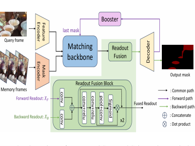
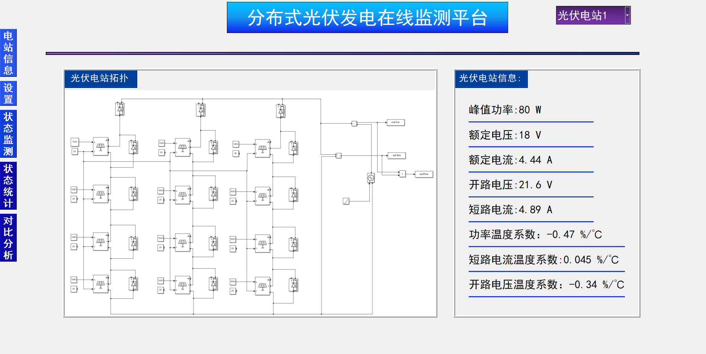
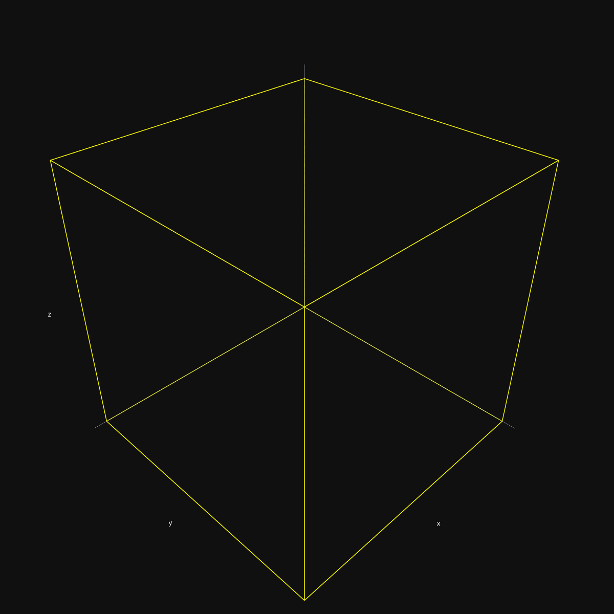

Hi! I'm a third year undergraduate student studying [Computer Science](https://www.cs.sjtu.edu.cn/) , at [Shanghai Jiao Tong University](https://www.sjtu.edu.cn/). Now I work as a research assistant in the [MVIG-RHOS](https://mvig-rhos.com/) group, supervised by Prof. [Yong-Lu Li](https://dirtyharrylyl.github.io/) and Prof. [Cewu Lu](https://www.mvig.org/), with PHD student [Xinpeng Liu](https://foruck.github.io/) as my mentor. My research interest includes Embodied AI, Machine Learning. My dream is to create a robot thinking and acting like a real human.

**Moreover, I'm looking for an opportunity to work with another group as an onsite/offsite research assistant this summer. If you could offer me this chance, please feel free to directly contact me!**

**My goal is to pursue a PhD position in 2026 Fall.**

<!-- [Email](whitefork@sjtu.edu.cn) / [Github](https://github.com/hitefork)  -->

[[Curriculum Vitae]](../files/RenderCV.pdf) / [[Wechat]](../images/wechat.png)

Education
------

### Shanghai Jiao Tong University

Sept 2022 - Present 
Undergraduate Student in Computer Science and Technology 
A member of The Zhiyuan Honors Program 
Core Courses: Machine Learning, Modern Opertaing System, Computational Theory 

Publications 
------

### ImDy: Human Inverse Dynamics from Imitated Observations

Xinpeng Liu, <strong>Junxuan Liang</strong>, Zili Lin, Haowen Hou, Yong-Lu Li*, Cewu Lu* 
ICLR, 2025
<a href="https://arxiv.org/abs/2410.17610">[Paper]</a> | 
<a href="https://github.com/Foruck/ImDy">[Code]</a> |
<a href="https://foruck.github.io/ImDy/">[Project]</a> |
<a href="https://www.youtube.com/watch?v=qDL8V2evAQQ">[Video]</a>
 

 

### Homogeneous Dynamics Space for Heterogeneous Humans

Xinpeng Liu, <strong>Junxuan Liang</strong>, Chenshuo Zhang, Zixuan Cai, Cewu Lu*, Yong-Lu Li* 
Arxiv Preprint
<a href="https://arxiv.org/abs/2412.06146">[Paper]</a> | 
<a href="https://github.com/Foruck/HDyS">[Code]</a> |
<a href="https://foruck.github.io/HDyS/">[Project]</a> |
<a href="https://www.youtube.com/watch?v=Gq1tVjgELBU">[Video]</a>
 

 

### M$^3$-VOS: Multi-Phase, Multi-Transition, and Multi-Scenery Video Object Segmentation

Zixuan Chen, Jiaxin Li, Liming Tan, Yejie Guo, <strong>Junxuan Liang</strong>, Cewu Lu, Yong-Lu Li*  
Arxiv Preprint
<a href="https://arxiv.org/abs/2412.13803">[Paper]</a> | 
<a href="https://zixuan-chen.github.io/M-cube-VOS.github.io/">[Project]</a> |
<a href="https://www.youtube.com/watch?v=K3M0QgKVQSI">[Video]</a>
 

 

Project
------

### Photovoltaic Power Generation Prediction System

Based on sparse coding, and distributed robust logistic regression algorithms 
<a href="https://github.com/hitefork/Photovoltaic-Power-Generation-Prediction-System">[Project]</a> 
 

 

### Machine Learning for 3D Bin Packing Problem

SJTU CS3308 Machine Learning final project 
Based on behaviour cloning and RL 
<a href="https://github.com/hitefork/ML-proj-BPP">[Project]</a> 
 

 

Research experience
------
* Feb 2024 – Present: Research Assistant
  * [RHOS team at Machine Vision and Intelligence Group (MVIG-RHOS)](https://mvig-rhos.com/), Shanghai Jiao Tong Univeisty, Shanghai, China
  * Exploited the recently progressive human motion imitation algorithms and trained a data-driven human inverse dynamics solver in a fully supervised manner
  * Supervised by Prof [Yong-Lu Li](https://dirtyharrylyl.github.io/) and Prof [Cewu Lu](https://www.mvig.org/)

* Sept 2023 – June 2024: Research Assistant
  * Department of Electrical Engineering, Shanghai Jiao Tong Univeisty, Shanghai, China
  * Proposed a distributed photovoltaic state monitoring model based on sparse coding, and distributed robust logistic regression algorithms
  * Supervised by Prof [Xiaoyuan Xu](https://xiaoyuan-xu.github.io/)

Awards
------
* [2024] Third-Class Scholarship, SJTU
* [2024] Merit Student (top 3%), SJTU
* [2024] National Special Award in [Electronic&Electrical Engineering Innovation Competition](https://eeeic.ces.org.cn/)
* [2024] Meritorious Winner in [Mathematical Contest In Modelling](https://www.comap.com/contests/mcm-icm) (Top 6.6%), America
* [2023] Zhiyuan Honors Program Scholarship, SJTU

Skills
------
* English
  * CET6 528
  * CET4 576
* Physics Engine
  * Nimble Physics
  * Mujoco
* Programming Language
  * Python
  * C++/C
* Sports
  * Basketball
  * Table Tennis

  
Service and leadership
------
∙ Currently participate in voluntary blood donation 
∙ A member of the Linux Club at Shanghai Jiao Tong University 

<!-- [Email](whitefork@sjtu.edu.cn) / [Github](https://github.com/hitefork)  -->
