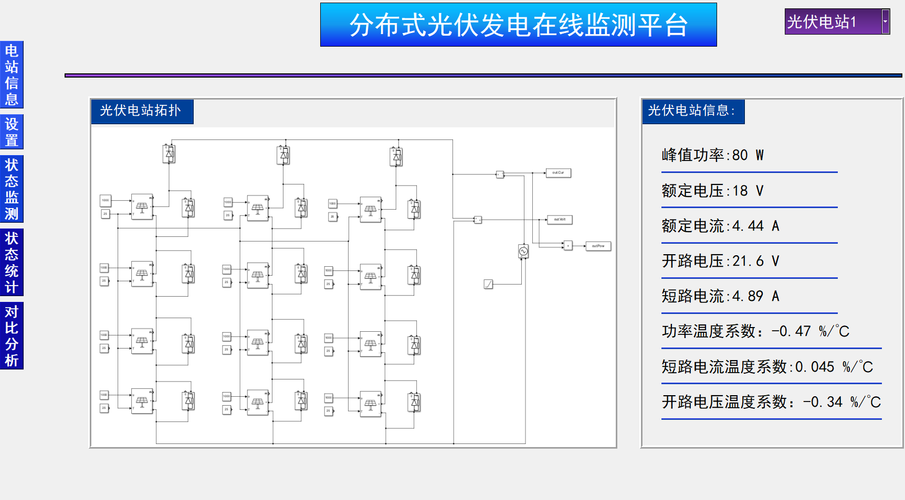

Hi! I'm a final-year undergraduate student at Shanghai Jiao Tong University. Now I work as a research assistant in the [MVIG-RHOS](https://mvig-rhos.com/) group, supervised by Prof. [Yong-Lu Li](https://dirtyharrylyl.github.io/) and Prof. [Cewu Lu](https://www.mvig.org/), with PHD student [Xinpeng Liu](https://foruck.github.io/) as my mentor. Moreover, I am very fortune to be a research assistant in [Cognitive Assistance Lab](https://www.cs.cmu.edu/~NavCog/) at Carnegia Mellon University, supervised by Prof. [Kris Kitani](https://kriskitani.github.io/), with PHD student [Jinkun Cao](https://www.jinkuncao.com/) as my mentor.

I am deeply interested in leveraging the inherent structure of the physical world, governed by its fundamental laws, to guide and inform more efficient and generalizable approaches to learning.

My research interest includes Embodied AI, Human Object Interaction, 3D Human Motion Generation. My dream is to create a robot thinking and acting like a real human.

**News: My PHD journey at Shanghai Jiao Tong University and Shanghai Innovation Institute will start next year, under the supervision of Prof. [Yichao Yan](https://daodaofr.github.io/) and Prof. [Yong-Lu Li](https://dirtyharrylyl.github.io/)**

<!-- [Email](whitefork@sjtu.edu.cn) / [Github](https://github.com/hitefork)  -->

[[Curriculum Vitae]](../files/RenderCV.pdf) / [[Wechat]](../images/wechat.png)

    
    

🎓 Education
------

### Shanghai Jiao Tong University

Sept 2022 - Present 
Undergraduate Student in Computer Science and Technology 
A member of The Zhiyuan Honors Program 
Core Courses: Machine Learning, Modern Opertaing System, Computational Theory 

📜 Publications
------

### ImDy: Human Inverse Dynamics from Imitated Observations

Xinpeng Liu, <strong>Junxuan Liang</strong>, Zili Lin, Haowen Hou, Yong-Lu Li*, Cewu Lu* 
ICLR, 2025
<a href="https://arxiv.org/abs/2410.17610">[Paper]</a> | 
<a href="https://github.com/Foruck/ImDy">[Code]</a> |
<a href="https://foruck.github.io/ImDy/">[Project]</a> |
<a href="https://www.youtube.com/watch?v=qDL8V2evAQQ">[Video]</a>
 

 

### Homogeneous Dynamics Space for Heterogeneous Humans

Xinpeng Liu, <strong>Junxuan Liang</strong>, Chenshuo Zhang, Zixuan Cai, Cewu Lu*, Yong-Lu Li* 
CVPR, 2025
<a href="https://arxiv.org/abs/2412.06146">[Paper]</a> | 
<a href="https://github.com/Foruck/HDyS">[Code]</a> |
<a href="https://foruck.github.io/HDyS/">[Project]</a> |
<a href="https://www.youtube.com/watch?v=Gq1tVjgELBU">[Video]</a>
 

 

### M$^3$-VOS: Multi-Phase, Multi-Transition, and Multi-Scenery Video Object Segmentation

Zixuan Chen, Jiaxin Li, Liming Tan, Yejie Guo, <strong>Junxuan Liang</strong>, Cewu Lu, Yong-Lu Li*  
CVPR, 2025
<a href="https://arxiv.org/abs/2412.13803">[Paper]</a> | 
<a href="https://zixuan-chen.github.io/M-cube-VOS.github.io/">[Project]</a> |
<a href="https://www.youtube.com/watch?v=K3M0QgKVQSI">[Video]</a>
 

 

📝 Project
------

### Photovoltaic Power Generation Prediction System

Based on sparse coding, and distributed robust logistic regression algorithms 
<a href="https://github.com/hitefork/Photovoltaic-Power-Generation-Prediction-System">[Project]</a> 
 

 

### LLM as a chatbot

SJTU CS4314 Natural Language Process final project 
Finetune based on Qwen 
<a href="https://github.com/hitefork/nlp_2024">[Project]</a> 
 

 

### Machine Learning for 3D Bin Packing Problem

SJTU CS3308 Machine Learning final project 
Based on behaviour cloning and RL 
<a href="https://github.com/hitefork/ML-proj-BPP">[Project]</a> 
 

 

💼 Research Experience
------
* May 2025 – Present: Research Assistant
  * [Cognitive Assitance Lab](https://www.cs.cmu.edu/~NavCog/), Carnegia Mellon University, Pennsylvania, USA
  * Explore physics-based whole-body human object interaction imitation across diverse objects and skills
  * Supervised by Prof [Kris Kitani](https://kriskitani.github.io/)

* Feb 2024 – Present: Research Assistant
  * [RHOS team at Machine Vision and Intelligence Group (MVIG-RHOS)](https://mvig-rhos.com/), Shanghai Jiao Tong Univeisty, Shanghai, China
  * Exploited the recently progressive human motion imitation algorithms and trained a data-driven human inverse dynamics solver in a fully supervised manner
  * Supervised by Prof [Yong-Lu Li](https://dirtyharrylyl.github.io/) and Prof [Cewu Lu](https://www.mvig.org/)

* Sept 2023 – June 2024: Research Assistant
  * Department of Electrical Engineering, Shanghai Jiao Tong Univeisty, Shanghai, China
  * Proposed a distributed photovoltaic state monitoring model based on sparse coding, and distributed robust logistic regression algorithms
  * Supervised by Prof [Xiaoyuan Xu](https://xiaoyuan-xu.github.io/)

🥇 Awards🥈🥉🏅🎖️
------
* [2024] Third-Class Scholarship🥉, SJTU
* [2024] Merit Student (top 3%)🥇, SJTU
* [2024] National Special Award in [Electronic&Electrical Engineering Innovation Competition](https://eeeic.ces.org.cn/)🥇
* [2024] Meritorious Winner in [Mathematical Contest In Modelling](https://www.comap.com/contests/mcm-icm) (Top 6.6%)🥉, America
* [2023] Zhiyuan Honors Program Scholarship🥇, SJTU

🧙‍♂️ Skills
------
* English
  * IELTS 6.5
  * CET6 528
  * CET4 567
* Physics Engine
  * Isaacgym
  * Nimble Physics
  * Mujoco
* Programming Language
  * Python
  * C++/C
* Sports
  * Basketball
  * Table Tennis

📚 Club
------
* A member of the Linux Club at Shanghai Jiao Tong University 

🤺 Hobby
------
* Historical research in world war II: Vive la Peace! 

🌐 related report
------
* [2024.08] [6项特等奖! 电院师生团队在第三届高校电气电子工程创新总决赛大放异彩](https://mp.weixin.qq.com/s/xy_w8iYb11BhPk_4KuV8Wg)

<!-- [Email](whitefork@sjtu.edu.cn) / [Github](https://github.com/hitefork)  -->
